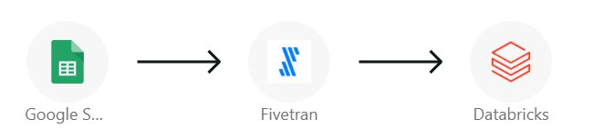
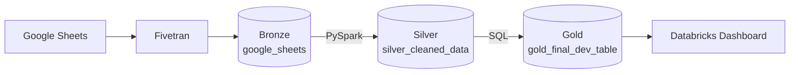
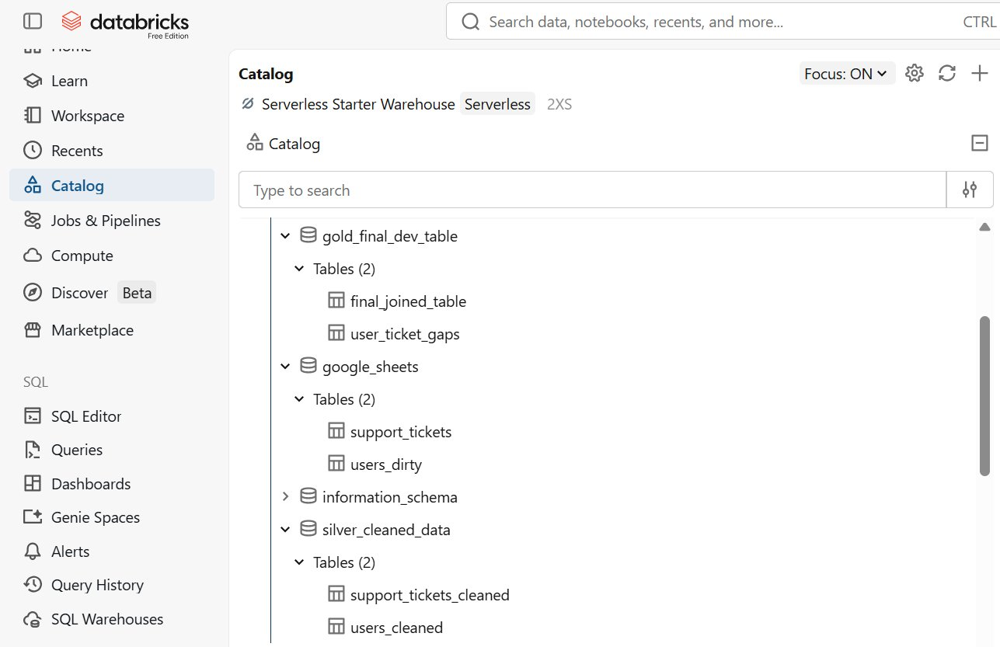
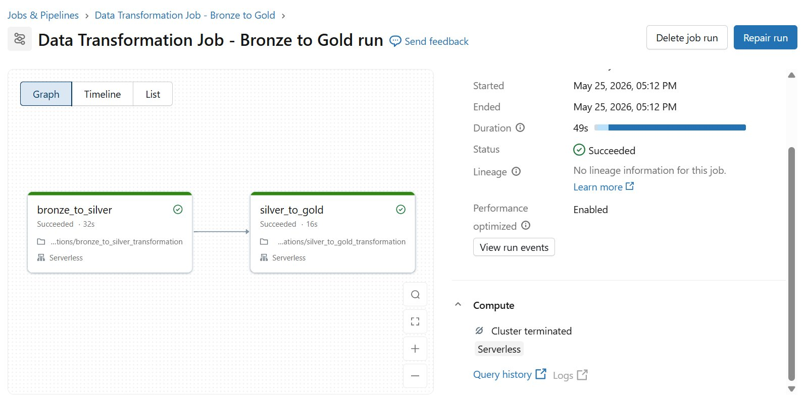
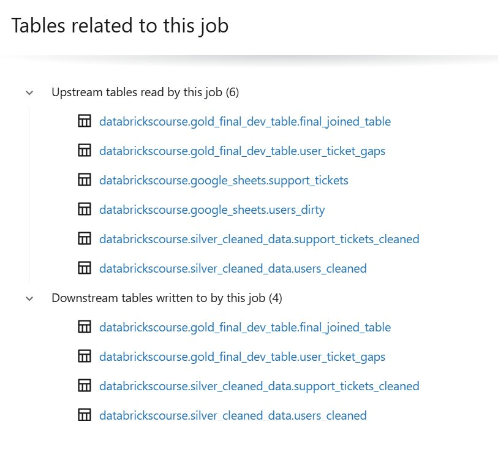
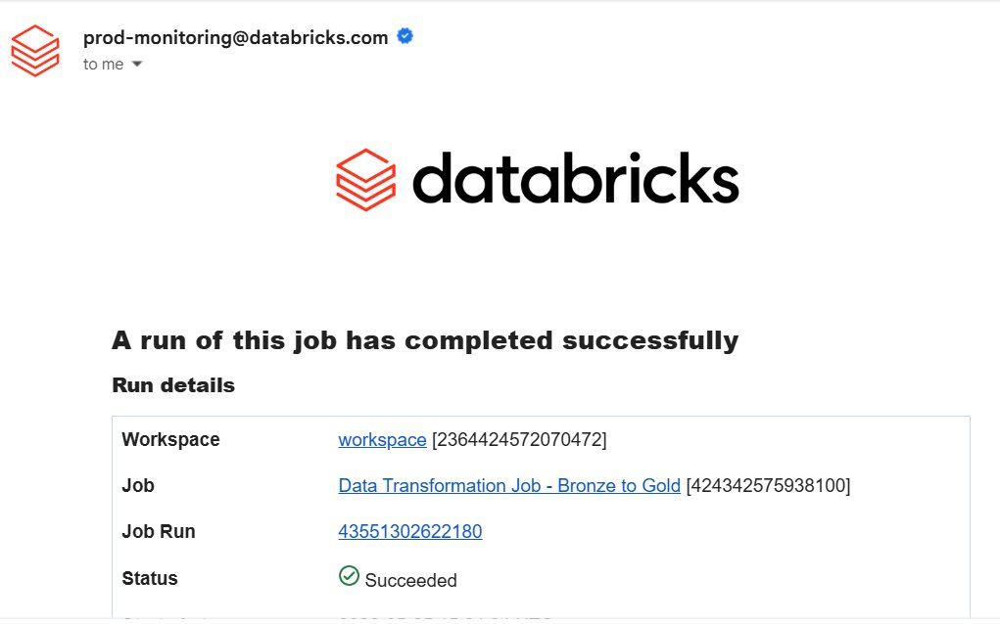

# Customer Support Analytics Pipeline on Databricks

End-to-end data pipeline that ingests customer support data from Google
Sheets, transforms it through a Medallion architecture, and surfaces the
results in a three-page dashboard. Built on Databricks with Fivetran
ingestion, Delta Lake storage, Unity Catalog governance, and orchestrated as
a scheduled Job with email notifications.



## Table of contents

1. [Executive summary](#executive-summary)
2. [Problem statement](#problem-statement)
3. [Solution overview](#solution-overview)
4. [Methodology](#methodology)
5. [Outcomes](#outcomes)
6. [Skills demonstrated](#skills-demonstrated)
7. [Tech stack](#tech-stack)
8. [Repository structure](#repository-structure)
9. [Scope and limitations](#scope-and-limitations)
10. [Author](#author)
11. [Acknowledgements](#acknowledgements)

## Executive summary

Customer support teams need answers to three recurring questions: is volume
trending up or down, where is resolution effort going, and which users have
gone silent. Answering them requires support data to be clean, joined, and
queryable, which raw exports from Google Sheets are not.

This project builds the pipeline that closes that gap. Two source tables
from Google Sheets are ingested through Fivetran into Databricks, cleaned
and conformed through bronze, silver, and gold layers, then exposed to a
Databricks Dashboard. The full pipeline runs in 49 seconds on serverless
compute, is orchestrated as a scheduled Job with email notifications, and
produces three analytical views: an executive KPI overview, a ticket
breakdown by category and region, and a user engagement table showing days
since each user's last contact.

## Problem statement

Support data sat in a Google Sheet with three issues that prevented direct
analysis:

- **Inconsistent date formats.** The `signup_date` column mixed `M/d/yy` with
  `M.d.yy`, so any time-based query failed or returned wrong results.
- **Duplicate user records.** Some `user_id` values appeared twice, which
  inflated user counts and broke joins.
- **No joined view.** Tickets and users lived in separate sheets. Every
  analytical question required a manual join, redone each time.

The team needed a managed pipeline that handled cleaning once, produced a
canonical joined dataset, and refreshed on a schedule.

## Solution overview

A Medallion-architecture pipeline on Databricks. Three layers, each with a
single responsibility:



| Layer  | Schema                  | Tables                                       | Responsibility                                                             |
|--------|-------------------------|----------------------------------------------|----------------------------------------------------------------------------|
| Bronze | `google_sheets`         | `users_dirty`, `support_tickets`             | Immutable raw landing from Fivetran. No transformation.                    |
| Silver | `silver_cleaned_data`   | `users_cleaned`, `support_tickets_cleaned`   | Parse the malformed date column. Drop duplicates on `user_id`.             |
| Gold   | `gold_final_dev_table`  | `final_joined_table`, `user_ticket_gaps`     | Join users to tickets. Derive days between consecutive tickets per user.   |



The deeper rationale for each layer's responsibilities, including why
`user_ticket_gaps` is a separate table rather than a column on the fact
table, is in [`docs/architecture.md`](docs/architecture.md).

## Methodology

The pipeline was built in five stages.

**1. Ingestion.** Fivetran connects to the source Google Sheet and replicates
the two tables into a bronze schema in Databricks Unity Catalog. Fivetran
adds two metadata columns to each table, `_row` and `_fivetran_synced`,
which flow through to the gold layer for lineage traceability.

**2. Bronze to silver, PySpark.** Notebook
[`01_bronze_to_silver_transformation.ipynb`](notebooks/01_bronze_to_silver_transformation.ipynb)
normalises the `signup_date` column. Source rows mix `.` and `/` as
separators, so the notebook replaces `.` with `/` and parses with the
`M/d/yy` format. It then applies `dropDuplicates(["user_id"])` to remove
duplicate user records. Support tickets pass through without transformation
since the source data is already clean, but they are still written to the
silver layer so that gold queries depend only on `silver_cleaned_data` and
never read bronze directly.

**3. Silver to gold, SQL.** Notebook
[`02_silver_to_gold_transformation.ipynb`](notebooks/02_silver_to_gold_transformation.ipynb)
produces two gold tables.
[`final_joined_table`](sql/gold_final_joined_table.sql) is the canonical
fact table, an inner join of users and tickets with all metadata preserved.
[`user_ticket_gaps`](sql/gold_user_ticket_gaps.sql) uses a `LAG` window
function partitioned by `user_id` and ordered by `created_date` to find
each user's prior ticket, then `DATEDIFF` to compute days between them.

**4. Orchestration.** Both notebooks run as a single Databricks Job,
`Data Transformation Job - Bronze to Gold`, with two sequential tasks on
serverless compute. Email notifications are configured on the job and fire
on every run. Unity Catalog tracks lineage automatically.







**5. Consumption.** A Databricks Dashboard reads directly from the gold
tables. Three pages each answer one of the original business questions.

## Outcomes

The pipeline delivers a working analytics layer for support data with the
operational properties to keep it reliable. What it produces:

**Three dashboard pages**, each backed by gold tables, that answer the
three opening questions. PDF exports live in [`dashboard/`](dashboard/).

| Page                                                       | Source table          | What it answers                                                    |
|------------------------------------------------------------|-----------------------|--------------------------------------------------------------------|
| [Executive Overview](dashboard/01_executive_overview.pdf)  | `final_joined_table`  | Total tickets, average resolution time, CSAT, monthly trend.       |
| [Ticket Analysis](dashboard/02_ticket_analysis.pdf)        | `final_joined_table`  | Tickets by category, priority, country. Resolution time by category. |
| [User Engagement](dashboard/03_user_engagement.pdf)        | `user_ticket_gaps`    | Days since last contact per user. Engagement patterns.             |

**Operational properties of the pipeline as built:**

- **Manual joins eliminated.** Support tickets and users arrive joined in
  the gold layer. Analysts query one table for the standard view, not two
  sheets in Excel.
- **Scheduled refresh, no manual SQL.** The Job runs the full bronze-to-gold
  chain end to end. Once configured, no human touches the transformations.
- **End-to-end runtime of 49 seconds** on serverless compute, measured from
  Job run history.
- **Full lineage in Unity Catalog.** Every gold table traces back to its
  silver and bronze sources automatically. A reviewer can answer "where did
  this number come from" through the lineage tab, without reading the
  notebooks.
- **Operational visibility through email notifications.** Every Job run,
  successful or failed, produces a notification. Stale dashboards are
  caught at the source rather than when someone notices a chart looks wrong.
- **Layer separation enforced by schema design.** Gold tables reference
  `silver_cleaned_data` only. Bronze data cannot be read into the dashboard
  by accident, because no gold query points at the `google_sheets` schema.
- **Pattern transfers.** The same three-layer structure, the same Job
  shape, and the same notification setup work for any other small-to-medium
  analytics domain without modification beyond the column names.

## Skills demonstrated

- **Data engineering.** Medallion architecture design, layer separation, and
  Delta Lake table management.
- **PySpark.** DataFrame transformations, regex-based string cleaning, type
  casting with `to_date`, deduplication with `dropDuplicates`.
- **SQL.** CTEs, inner joins, window functions (`LAG` with
  `PARTITION BY` and `ORDER BY`), `DATEDIFF`, schema and table DDL.
- **Databricks platform.** Unity Catalog (catalogs, schemas, lineage), Delta
  tables, Workflows / Jobs with task dependencies, serverless compute,
  Dashboards, Genie spaces for natural-language querying of the gold tables.
- **Ingestion.** Fivetran connector configuration, handling of Fivetran
  metadata columns (`_row`, `_fivetran_synced`) downstream.
- **Operational practices.** Job-level email notifications, layered
  dependencies that prevent gold-from-bronze reads, immutable bronze
  pattern.

## Tech stack

| Concern         | Tool                                                 |
|-----------------|------------------------------------------------------|
| Source          | Google Sheets                                        |
| Ingestion       | Fivetran                                             |
| Storage         | Delta Lake on Databricks Unity Catalog               |
| Bronze → Silver | PySpark                                              |
| Silver → Gold   | SQL (Databricks SQL)                                 |
| Compute         | Databricks Serverless                                |
| Orchestration   | Databricks Workflows                                 |
| Monitoring      | Email notifications on success and failure           |
| Consumption     | Databricks Dashboards                                |

## Repository structure

```
customer-support-medallion-pipeline/
├── data/raw/              Source CSVs committed for reproducibility
├── notebooks/             Bronze-to-silver (PySpark) and silver-to-gold (SQL)
├── sql/                   Gold-layer SQL extracted from the notebook
├── dashboard/             PDF exports of the three dashboard pages
├── docs/
│   ├── architecture.md    Deeper write-up of design choices
│   └── images/            Screenshots referenced from this README
├── README.md
└── LICENSE
```

## Scope and limitations

The source dataset is 50 users and 40 tickets, sized to make the
architecture easy to follow end to end. The transformations, Unity Catalog
lineage, orchestration, and monitoring are real and run as shown. A
production build on a larger dataset would add incremental processing with
watermarks, schema-evolution handling, environment promotion from dev to
prod, automated data quality checks, and CI on the notebooks.

## Author

Joshua Minyoi. Data and Operations professional based in Lusaka, Zambia.

GitHub: [@Joshua-Minyoi](https://github.com/Joshua-Minyoi)

## Acknowledgements

Alex The Analyst, Analyst Builder Databricks course.

## License

MIT. See [LICENSE](LICENSE).
